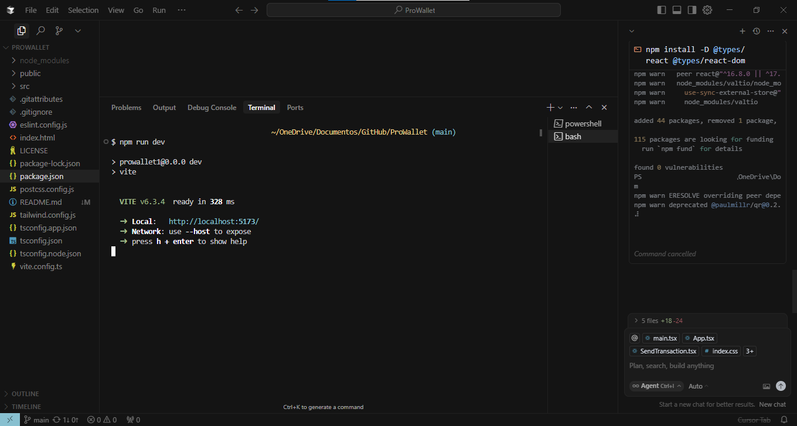

# 💼 ProWallet

**ProWallet** é uma carteira Web3 segura e moderna, desenvolvida com React, Vite e Wagmi. Oferece uma interface amigável para conexão via MetaMask, exibição de saldo e envio de transações on-chain.

---

## 🚀 Funcionalidades

- 🔐 Conexão com carteiras Ethereum usando RainbowKit + MetaMask
- 👛 Exibição do saldo da carteira conectada
- 📤 Envio de transações usando o pacote `viem`
- 🎨 Interface moderna com estilização baseada em Tailwind CSS
- ⚡️ Vite para build rápido e eficiente

---

## 🛠️ Tecnologias Utilizadas

- [React](https://reactjs.org/)
- [Vite](https://vitejs.dev/)
- [Wagmi](https://wagmi.sh/)
- [Viem](https://viem.sh/)
- [RainbowKit](https://www.rainbowkit.com/)
- [Tailwind CSS](https://tailwindcss.com/)
- [TypeScript](https://www.typescriptlang.org/)

---

## 📸 Interface

> Interface moderna com gradientes azul e roxo, pensada para transmitir tecnologia e confiança.

---

## 🔧 Como Rodar o Projeto Localmente

1. **Clone o repositório:**

```bash
git clone https://github.com/beto-rocha-blockchain/ProWallet.git
cd ProWallet
```

2. **Instale as dependências:**

```bash
npm install
```

3. **Inicie o projeto:**

```bash
npm run dev
```
4. **Acessando o host:**

  - Acesse: http://localhost:5173
  - Caso encontre problemas ou querira dar sugestões, entre em contato!
